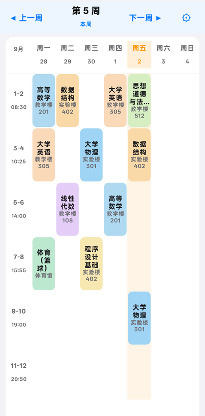
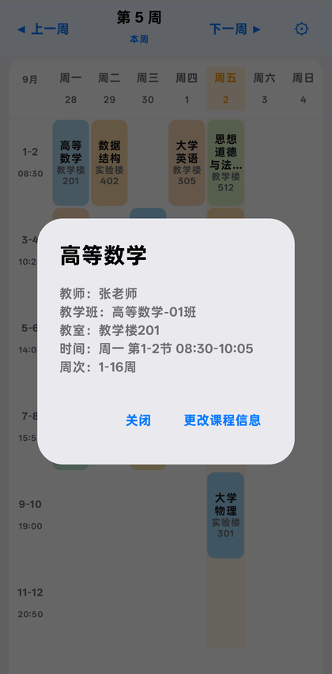
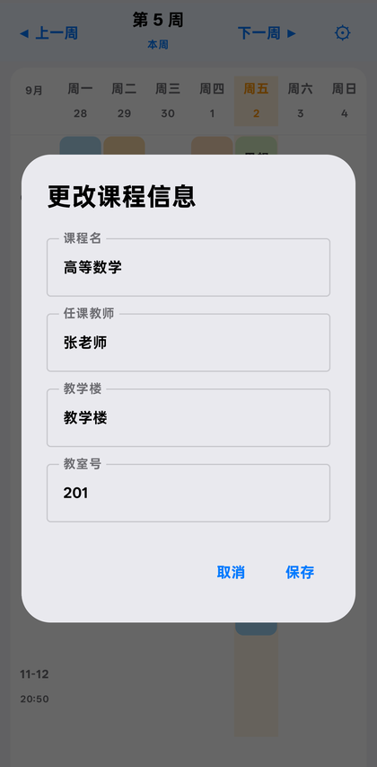
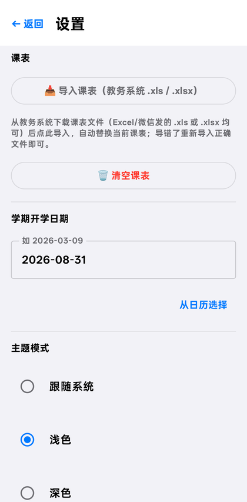
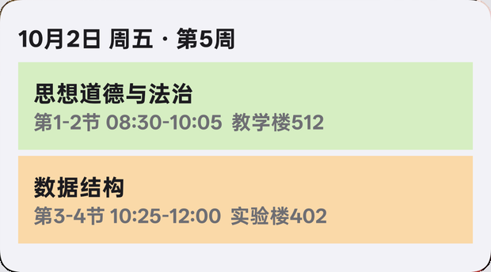
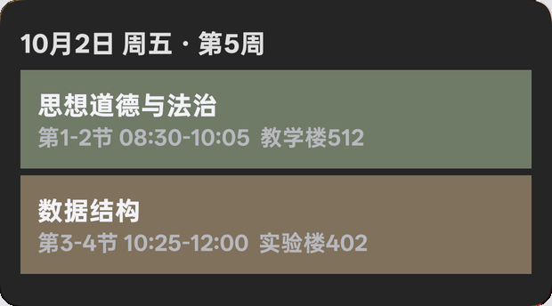

# 课表 CourseSchedule

**完全离线的 Android 课表查看应用** —— Jetpack Compose 编写，无广告、无账号、无后台服务，课表只存在你自己手机里。

出厂是空课表：从教务系统导出 `.xls` / `.xlsx` 导进来就能用。

**[下载最新版](https://github.com/Nixscc-Txy/CourseSchedule/releases/latest)** · Android 8.0+ · Kotlin 2.2 · [MIT](LICENSE)

---

## 功能

| | |
|---|---|
| **滑动切周** | 课表区域左右滑动即可切换上一周/下一周，带滑动动画；顶部箭头同样顺滑，翻走了一键「⤴ 回到本周」 |
| **自动定位** | 设置学期起始日期后自动跳到当前周；没设时给出提示入口 |
| **上课时间** | 单元格同时显示节次与实际时间（`1-2` / `08:30`），课程详情里带 `08:30-10:05` |
| **今日高亮** | 当天那一列高亮 —— 只在本周高亮，翻到别的周不会指错日期 |
| **课程详情** | 点课程块看教师、教学班、教室、时间、周次 |
| **编辑课程** | 详情右下角「更改课程信息」，可改课名 / 任课教师 / 教学楼 / 教室号，改完立刻生效并固化 |
| **导入课表** | 手机上直接选教务系统导出的 `.xls` / `.xlsx`（无需电脑），也支持 `schedule.json` |
| **冲突处理** | 班级课表里的平行选修（英语/日语…）排在同一时段时，导入时让你挑出实际要上的那门，也可以「这组我都不上」；同一批课在多天同时开只问一次 |
| **冲突补选** | 课表里还有没解决的时间冲突时，顶部提示并提供补选入口，不必重新导入文件 |
| **同格多门** | 未解决冲突时同一格的多门课**全部显示**、各自可点，不会只显示第一门 |
| **主题** | 浅色 / 深色 / 跟随系统，状态栏图标跟随 App 内主题 |
| **桌面小组件** | 显示今日剩余课程；今天上完了会显示「当天无更多课程」并把明天的前两节课顶上来，每门标出第几节；跨午夜由闹钟自动刷新 |
| **小组件配色** | 可单独给小组件选「跟随主体 / 浅色 / 深色」，与 App 主题互不影响 |
| **检查更新** | 设置页可检查有没有新版本，有则给出下载入口 |
| **清空课表** | 设置页一键清空（含二次确认），回到空白状态 |

## 安装

1. 到 [Releases](https://github.com/Nixscc-Txy/CourseSchedule/releases/latest) 下载 `app-release.apk`
2. 手机需 **Android 8.0（API 26）及以上**
3. 安装时允许「未知来源应用」；若提示「未经检测的应用」选「仍然安装」
4. 打开 App → 设置 → 导入课表

> 覆盖安装不会丢课表和设置（前提是用同一把签名密钥，见 [发版文档](docs/release.md)）。

## 截图

| 周视图 | 课程详情 | 编辑课程信息 | 设置 |
|:---:|:---:|:---:|:---:|
|  |  |  |  |

| 桌面小组件 · 浅色 | 桌面小组件 · 深色 |
|:---:|:---:|
|  |  |

## 文档

| 文档 | 内容 |
|---|---|
| [导入课表](docs/import.md) | 手机直接导入、电脑端转换脚本、冲突选课、换学期 |
| [课表数据格式](docs/data-format.md) | `schedule.json` 字段说明与节次时间表 |
| [开发](docs/development.md) | 环境要求、构建与测试、目录结构、架构说明 |
| [发版](docs/release.md) | 签名配置、一条命令发版、检查更新与权限取舍 |

## 隐私

- 本 App **只有 `INTERNET` 一个权限**，且只用在设置页的「检查更新」——读取一次 GitHub 的发布信息判断有没有新版本，**只读取、不上传任何数据**。
- 课表、选课结果、学期设置全部只存在手机本地（App 私有目录与 SharedPreferences），不联网、不外传。
- 桌面小组件与主界面读的是同一份本地数据。

## 自己构建

`@bash
git clone https://github.com/Nixscc-Txy/CourseSchedule.git
cd CourseSchedule
./gradlew assembleDebug        # 产物 app/build/outputs/apk/debug/app-debug.apk
`@

需要 JDK 17+ 与 Android SDK（compileSdk 36）。发布签名、测试与发版流程见 [开发](docs/development.md) 与 [发版](docs/release.md)。

## 许可

[MIT](LICENSE)
